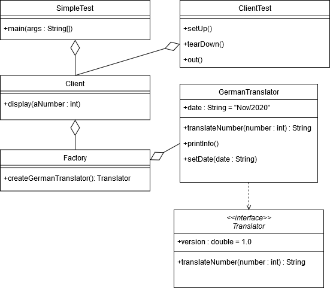

# SE-Übung1
von Laurenz Dilba (9037743)
und Ron Autenrieb (9037538)

## UML-Klassendiagramm

##Test Suite

###Tests
TestCase No. | Category | Äquivalenzklasse | Input | Output
--- | --- | --- | --- | --- |
1 | neg | ÄK <0 | -1 | Übersetzung der Zahl -1 nicht möglich (1.0)
2 | neg | ÄK >10 | 11 | Übersetzung der Zahl 11 nicht möglich (1.0)
3 | neg | | 0 | Übersetzung der Zahl 0 nicht möglich (1.0)
4 | pos | ÄK 1<=x<=10 | 7 | Das Ergebnis der Berechnung: [sieben]

###Zugehörige Äquivalenzklassen
Parameter | Äquivalenzklasse | Repräsentant
--- | --- | ---
input | ÄK <0 | -1
input | ÄK >10 | 11
input | ÄK 1<=x<=10 | 7

###Separate Testfälle

**Testfall 0**
